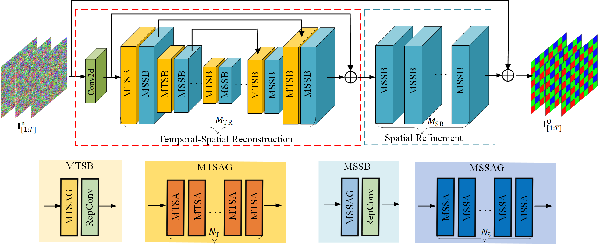

# RViDeformer: Efficient Raw Video Denoising Transformer with a Larger Benchmark Dataset

This repository contains official implementation of RViDeformer: Efficient Raw Video Denoising Transformer with a Larger Benchmark Dataset in TCSVT 2025, by Huanjing Yue, Cong Cao, Lei Liao, and Jingyu Yang. [[arxiv]](https://arxiv.org/abs/2305.00767) [[journal]](https://ieeexplore.ieee.org/document/10935691)

<p align="center">
  
</p>

## Dataset
### Recaptured Raw Video Denoising Dataset (ReCRVD Dataset)

<p align="center">
  
</p>

We propose capturing noisy-clean pairs by sequentially displaying existing high-resolution video frames on a 4K screen and recapturing the screen content. You can download our dataset from [Google Drive](https://drive.google.com/drive/folders/1aLrW1ssGmT2V_vOdrIL9q9dH-4mVb5zq?usp=sharing) or [MEGA](https://mega.nz/folder/0IxTTaAL#9Oxb87ZG0z6zNh1Q1LL5zQ) or [Baidu Netdisk](https://pan.baidu.com/s/1XWn-SFpP2v55Qh-fxQqmQQ) (key: ogyw). We totally captured 120 scenes under five different ISO levels ranging from 1600 to 25600. These 120 scenes are divided into a training set (90 scenes) and a testing set (30 scenes). The training and test scenes are listed in train.txt and test.txt, respectively. You can visualize data with the code in folder "isp_matlab" or using the ISP module in [RViDeNet](https://github.com/cao-cong/RViDeNet).

## Code

### Dependencies

- python == 3.8
- pytorch == 1.11
- ptflops == 0.6.5

### Test
Please download 
RViDeformer and ISP weights from [Google Drive](https://drive.google.com/drive/folders/1HJuJfofg3hsoPB3yHJCkfeel2Uf53ejF?usp=sharing) or [Baidu Netdisk](https://pan.baidu.com/s/14srTNWoeEgyn7gL2WUpoFQ) (key: 4g5b).
- Test RViDeformer on ReCRVD testing set.
  ```
  python test_ReCRVD_MergeReparametersInference.py
  ```
- Test RViDeformer on CRVD indoor testing set.
  ```
  python test_CRVD_MergeReparametersInference.py
  ```
### Train
- Train RViDeformer on ReCRVD training set (supervised manner).
  ```
  python train_ReCRVD_supervised.py
  ```
- Train RViDeformer on CRVD training set (supervised manner).
  ```
  python train_CRVD_supervised.py
  ```
- Train RViDeformer on ReCRVD training set (unsupervised manner).
  ```
  python train_ReCRVD_unsupervised.py
  ```
- Train RViDeformer on CRVD training set (unsupervised manner).
  ```
  python train_CRVD_unsupervised.py
  ```

## Citation

If you find our dataset or code helpful in your research or work, please cite our paper:
```
@article{yue2025rvideformer,
  title={Rvideformer: Efficient raw video denoising transformer with a larger benchmark dataset},
  author={Yue, Huanjing and Cao, Cong and Liao, Lei and Yang, Jingyu},
  journal={IEEE Transactions on Circuits and Systems for Video Technology},
  year={2025},
  publisher={IEEE}
}
```