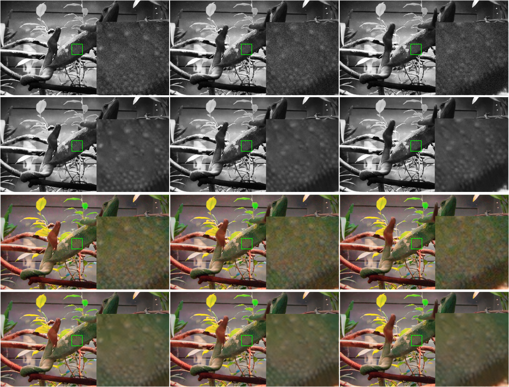

# RViDeformer: Efficient Raw Video Denoising Transformer with a Larger Benchmark Dataset

### Recaptured Raw Video Denoising Dataset (ReCRVD Dataset)

  

  

You can download our dataset from [Google Drive](https://drive.google.com/drive/folders/1aLrW1ssGmT2V_vOdrIL9q9dH-4mVb5zq?usp=sharing) or [MEGA](https://mega.nz/folder/0IxTTaAL#9Oxb87ZG0z6zNh1Q1LL5zQ) or [Baidu Netdisk](https://pan.baidu.com/s/1XWn-SFpP2v55Qh-fxQqmQQ) (key: ogyw).