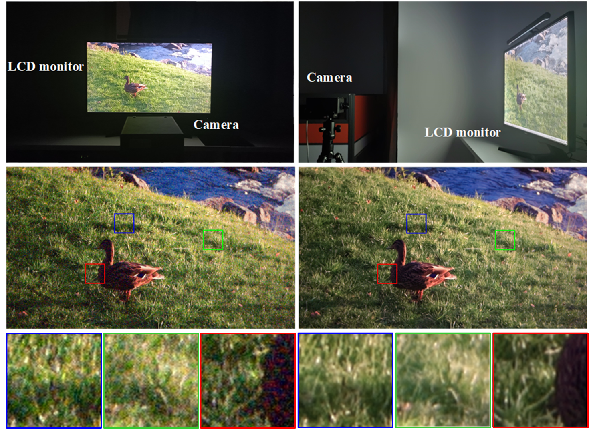

# RViDeformer: Efficient Raw Video Denoising Transformer with a Larger Benchmark Dataset

This repository contains official implementation of RViDeformer: Efficient Raw Video Denoising Transformer with a Larger Benchmark Dataset in TCSVT 2025, by Huanjing Yue, Cong Cao, Lei Liao, and Jingyu Yang.

### Recaptured Raw Video Denoising Dataset (ReCRVD Dataset)

  

We propose capturing noisy-clean pairs by sequentially displaying existing high-resolution video frames on a 4K screen and recapturing the screen content. You can download our dataset from [Google Drive](https://drive.google.com/drive/folders/1aLrW1ssGmT2V_vOdrIL9q9dH-4mVb5zq?usp=sharing) or [MEGA](https://mega.nz/folder/0IxTTaAL#9Oxb87ZG0z6zNh1Q1LL5zQ) or [Baidu Netdisk](https://pan.baidu.com/s/1XWn-SFpP2v55Qh-fxQqmQQ) (key: ogyw). We totally captured 120 scenes under five different ISO levels ranging from 1600 to 25600. These 120 scenes are divided into a training set (90 scenes) and a testing set (30 scenes). The training and test scenes are listed in train.txt and test.txt, respectively. You can visualize data with the code in folder "isp_matlab" or using the ISP module in [RViDeNet](https://github.com/cao-cong/RViDeNet).
